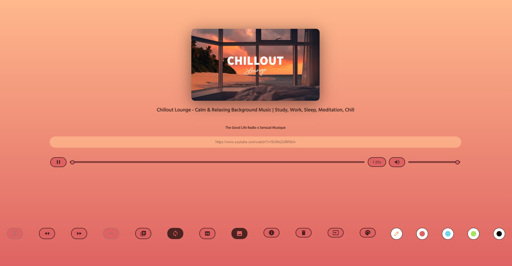
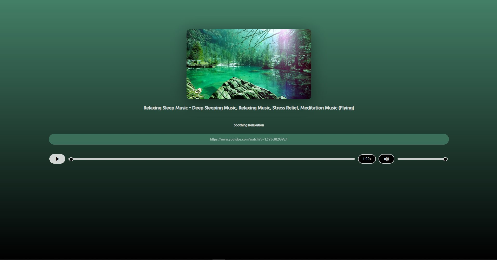

 
   </img>

   </img>

  <h1> ytify -the minimal streaming app</h1>

  
 🌟This is ytify - a minimal streaming app with which you can stream YouTube audio efficiently ( at around 50kbps & 160kbps) to save data and time. 🌟
 

  <h1> Why use ytify ?</h1>

  
 Ytify has lots of features to ensure a pleasurable streaming experience. 

 

 
 
    <ul style="; margin-top:20px;margin-left:-20px;
    " > 
       <li>Rewind a video at any time and add more videos to playing list using queue  ✔️ </li> 
       <li>Skip any track anywhere or loop your favorite ones.  ✔️</li> 
       <li> Automatically play links w. auto.✔️</li> 
       <li> Set  a higher quality of HQ 128kbps if you want to,
       this only takes 1MB per minute. ✔️ </li> 
       <li> Clear all your saved data. ✔️</li> 
       <li> Use darkmode. ✔️</li> 
    </ul> 

  
 
 
 

 

   <h1>  How to use</h1>
   
Here are some quick instructions to get ytify running.. 

  

 
 
    <ul style=" margin-top:20px;margin-left:-20px;
    " > 
       <li>Copy the YouTube Video Url ⭐	</li> 
       <li> Paste it into the ytify clipboard. ⭐	 </li> 
       <li>Ytify will do the rest. Enjoy ! ⭐	 </li> 
       <li>You can set clipboard permission (use link input box
    otherwise)🌠  </li>
       <li> There is fallback support (if no Clipboard API exists) 🌠 </li>
       <li>Thers is no auto-scanning 🌠  </li>
    </ul> 

  
 
 

  
  

    <h1 style="margin-top:50px">Snapshots  </h1>
    
✨Let ´s see how ytify looks like ! ✨ 

  

  
  
  
  
  
   

  

  <h1>Dependencies </h1>
    <ul style="margin-left:-20px"> 
    <li>
    <a href="https://projectlounge.pw/ytdl"> Project Lounge ytdlp web ui ✅ </a></li>
    <li>
    <a href="https://noembed.com"> noembed ✅</a></li>
    <li>
    <a href="https://github.com/luukdv/color.js/">color.js ✅ </a></li>
    <li>
    <a href="https://youtube.com"> YouTube ✅</a></li>
    <li> <a href="https://spck.io"> Spck Code Editor ✅</a></li>
    <li>
    <a href="https://github.com/ytdl-org/youtube-dl">YTDL ✅ </a></li>
    <li>
    <a href="https://github.com/yt-dlp/yt-dlp"> yt-dlp ✅</a></li>
    <li>
    <a href="https://www.netlify.com">Netlify ✅ </a> </li>
    <li>
    <a href="https://fonts.google.com">Google fonts ✅ </a> </li>
  </ul>
  
   

  

    <h1 style="margin-top:20px"> Our mission </h1>
    
 We want to  to help you save data when streaming YouTube videos. ✨

   

  <h1> Contribute</h1>
 

 
    
  
 Found a bug or feel comfortable fixing an issue ?
       Then feel free to contribute. It ´s very simple. Simply fork the project and clone it. Make your changes and make
       a new branch , then push the code and make a pull request.
       It ´s that simple ! 🏆 

    

  
 
 

 

