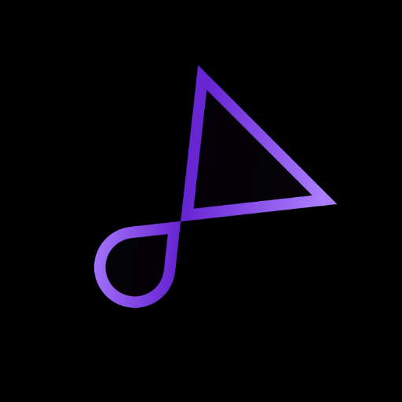

# ytify

Minimal youtube audio streaming front-end.

Streams youtube audio only in ultra low bitrate at around 50kbps, save data!

https://ytify.netlify.app

## How It's Used
- Copy youtube video link to clipboard.
- The link is automatically captured on the page and starts playing automatically.
- Fallback Support is available for users without support for Clipboard API.

## Thanks to
- YouTube.com - Hosting Content.
- Spck.io - Coding Platform.
- YouTubeDL - Main Extractor.
- yt-dlp - YouTube DL Fork.
- Projectlounge.pw/ytdl - yt-dlp FrontEnd.
- Spectre.CSS - Design Framework.
- Netlify.com - Hosting Site.
- Google Fonts - Font Support.
