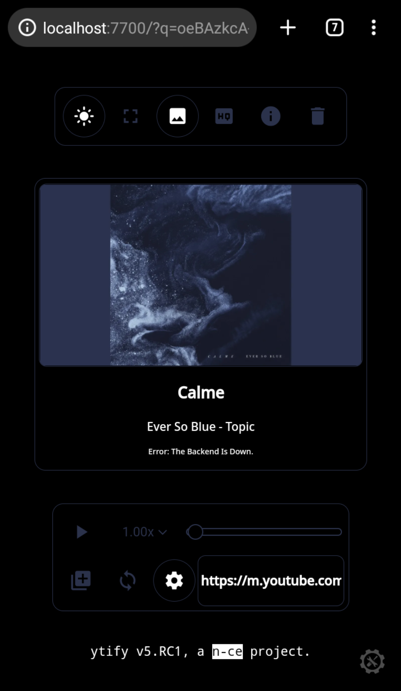
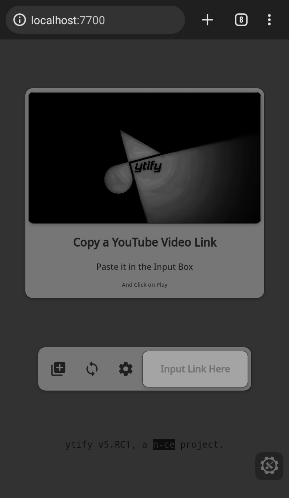
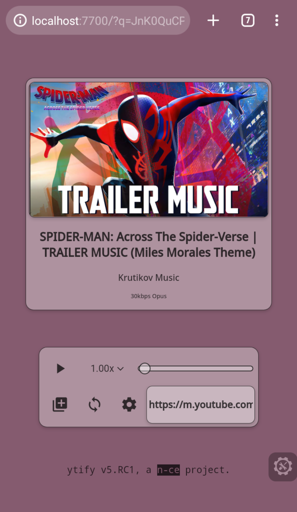
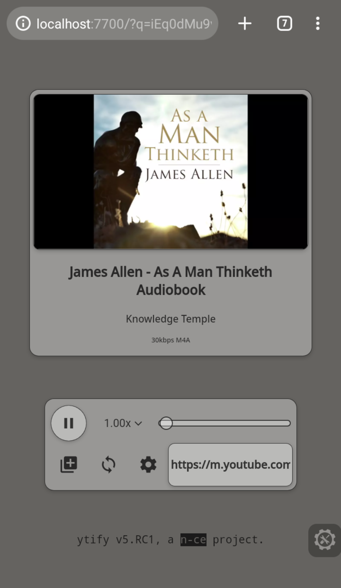
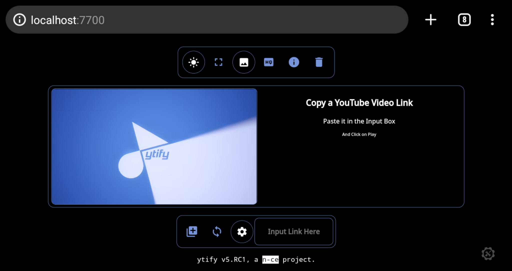

<div align="center">
  <h1>🎄 YTIFY 🎄</h1>
  
  <br>
  
</div>

## Description 🦚
 - the name is a portmanteau for yt(YouTube) and spotify.
 - the app is a minimal audio streaming front-end which captures youtube links in order to provide the user with a playable audio stream easily.
 - it also encapsulates a number of features that make user experience smoother and personalised.
 - works even on the lowest bandwidth, never worry about metered data consumption anymore.

## File Structure 📂
```
ytify
├─── Assets/.. 
├─── Scripts
│    ├─── init.js
│    ├─── constants.js
│    ├─── main.js
│    ├─── buttons.js
│    └─── service-worker.js
├─── Stylesheets
│    ├─── main.css
│    ├─── data.css
│    ├─── player.css
│    └─── settings.css
├─── index.html
├─── 404.html
├─── manifest.json
├─── README.md
└─── LICENSE
```
## Screenshots 🖼

<p align="center">
  
  
  
  
  
  
  
  
  
  
</p>

## Acknowledgments 🙏
- [noembed](https://noembed.com)
- [corsproxy.io](https://corsproxy.io)
- [color.js](https://github.com/luukdv/color.js)
- [yt-dlp](https://github.com/yt-dlp/yt-dlp)
- [netlify](https://www.netlify.com)
- [google Fonts & Icons](https://fonts.google.com)
