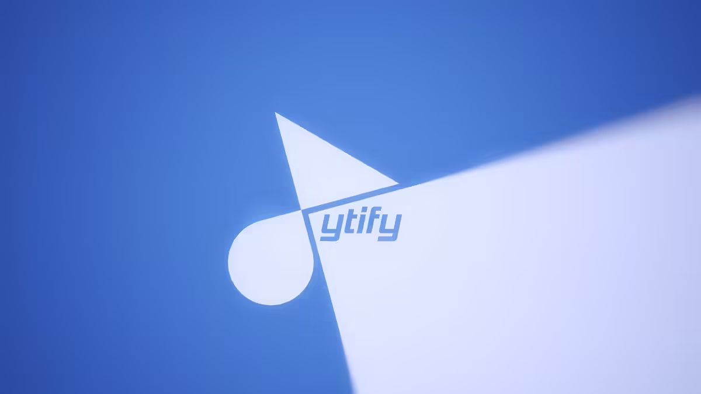
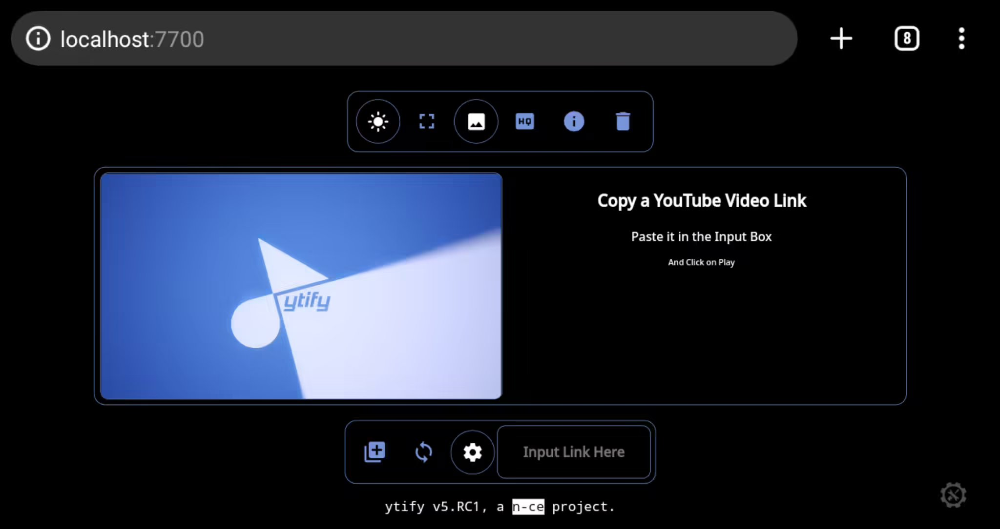
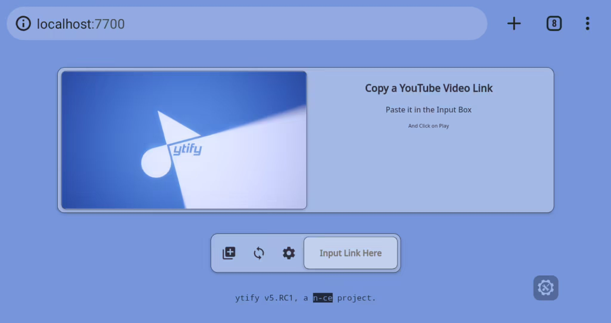
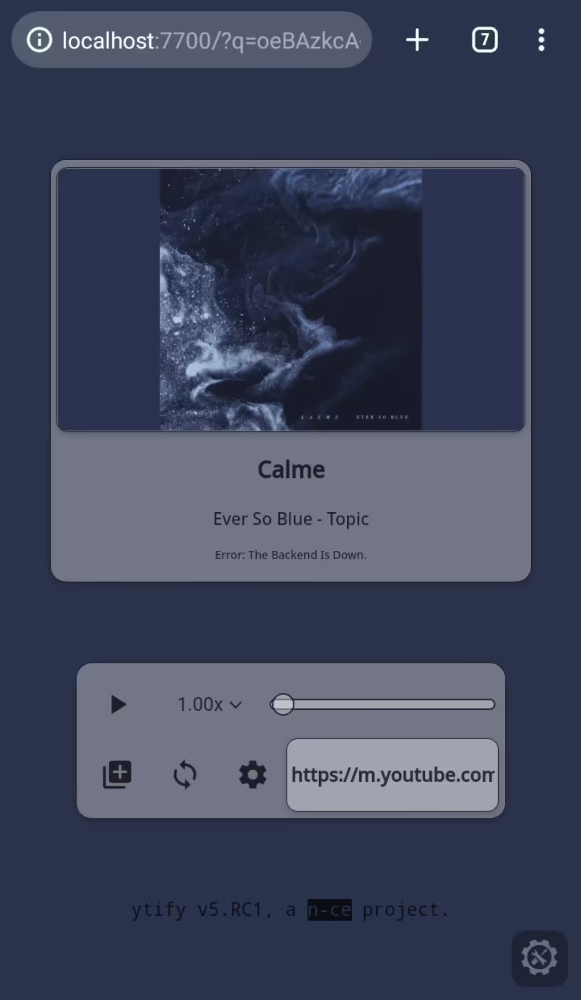
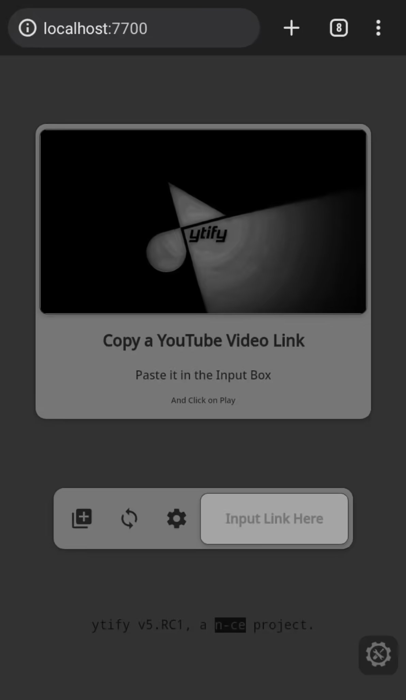
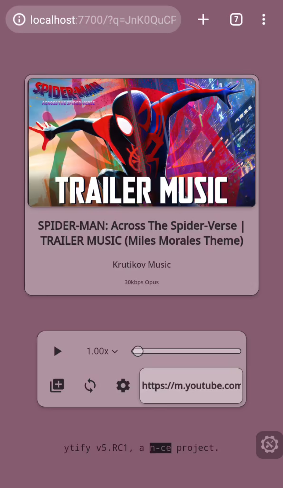
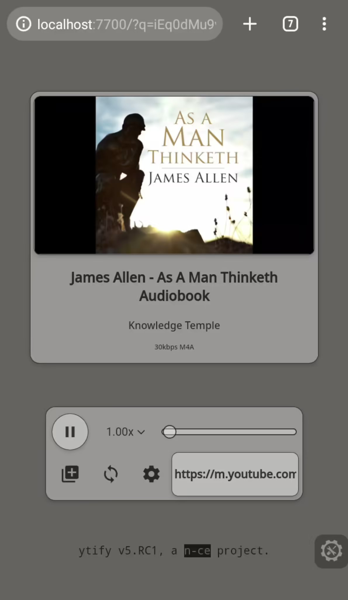
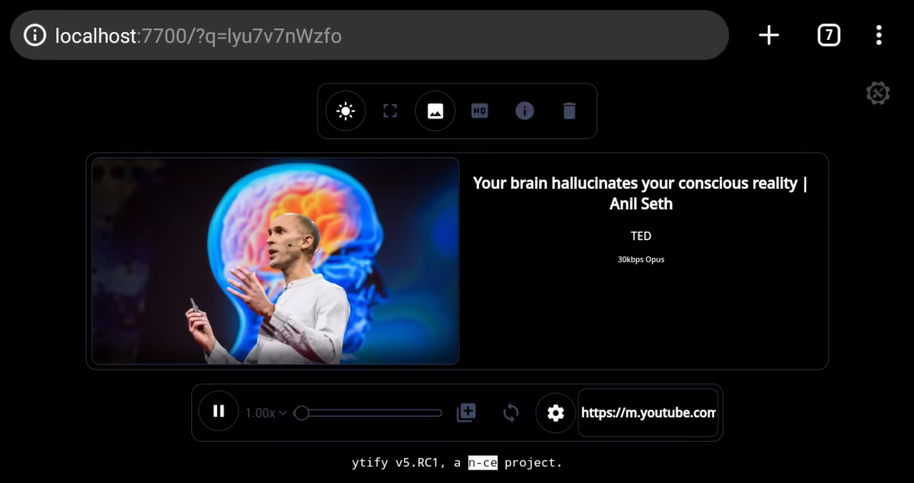
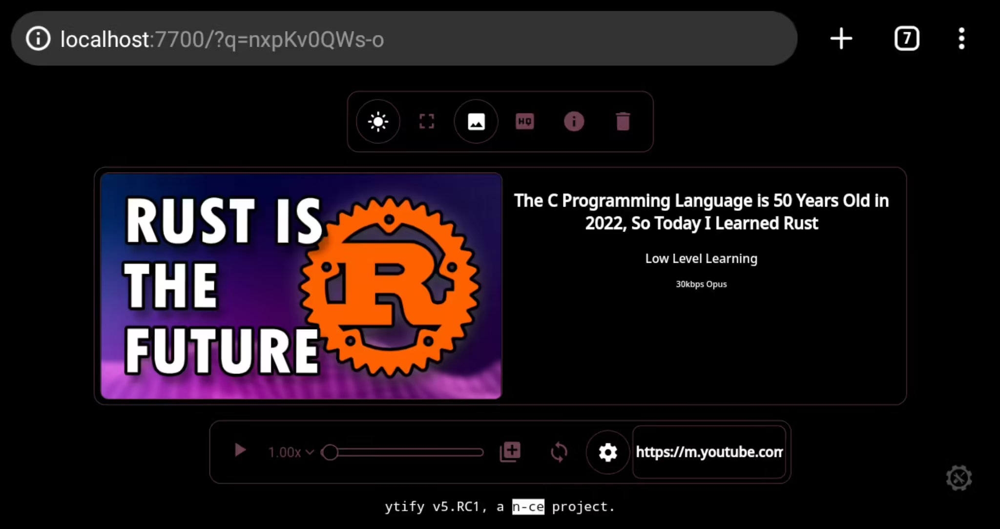
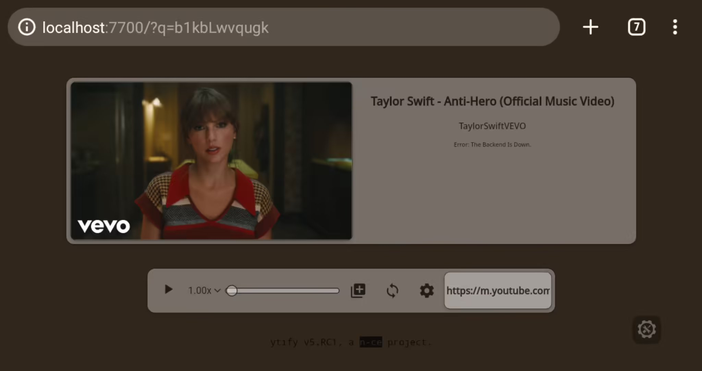

<div align="center">
 <h1> 💠 YTIFY 💠 </h1>
 
</div>

## Table of Contents
- [**Description 🦚**](#description-)
- [**File Structure** 📂](#file-structure-)
- [**Getting Started** 🖼](#getting-started-)
- [**Licence** 📝](https://github.com/n-ce/ytify/blob/main/LICENSE)
- [**Contributing** 📋](https://github.com/n-ce/ytify/blob/main/CONTRIBUTING.md)
- [**Acknowledegments** 🙏](#acknowledgements-)


## Description 🦚
**ytify**, is a fast & simple audio streaming web application which takes youtube links as input and outputs a stream of audio. ytify allows users to listen without worrying about slow internet speeds or 
data consumption. It also provides a smooth and personalised user experience with features including:

 - **Queue** : Always have something coming up next. ytify lets you add multiple links to keep your music going. 
 - **Playlist Support** : Drop the link to a youtube playlist to fill up your queue without having to copy and paste each link. 
 - **Theming** : ytify personalizes itself using colours selected from the thumbnail of your youtube stream. 
 - **PWA** : Can be installed as an app in your device, then you can directly open youtube links with ytify through your OS share menu.

## File Structure 📂
```
ytify
├─── Assets/.. 
├─── Scripts
│    ├─── constants.js
│    ├─── main.js
│    ├─── buttons.js
│    └─── service-worker.js
├─── Stylesheets
│    ├─── main.css
│    ├─── data.css
│    ├─── player.css
│    └─── settings.css
├─── index.html
├─── 404.html
├─── manifest.webmanifest
├─── README.md
└─── LICENSE
```
## Getting Started 🖼
To use ytify, simply navigate to our website, paste a youtube link, and press play!
Take a look at some Screenshots here ->
<p align="center">
  
  
  
  
  
  
  
  
  
  
</p>


## Acknowledgements 🙏
- [Piped](https://github.com/teampiped/piped)
- [Netlify](https://www.netlify.com)
- [Remix Icons](https://github.com/Remix-Design/RemixIcon)
- [Google Fonts](https://fonts.google.com)
