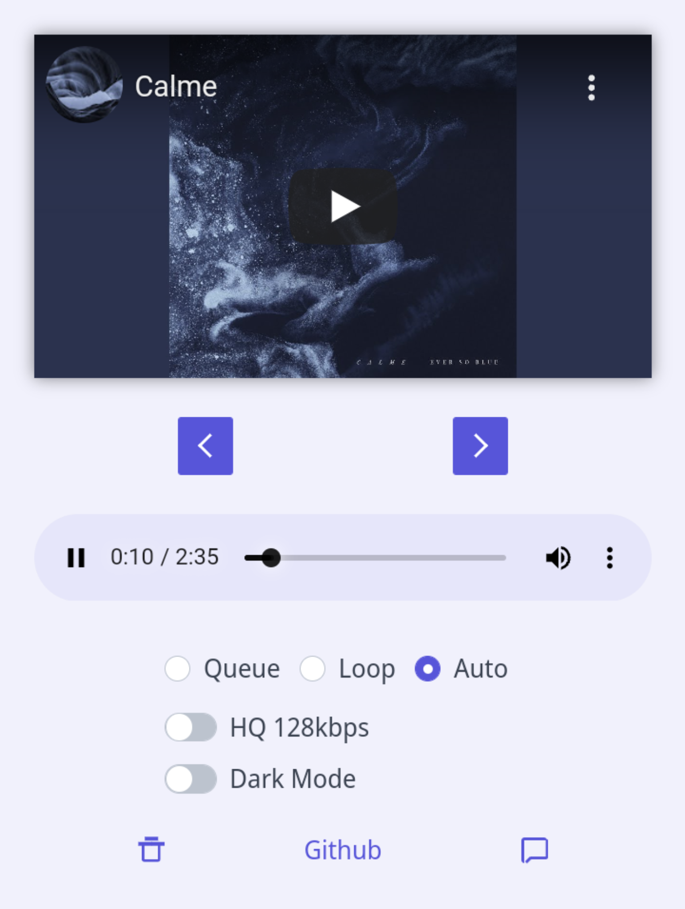

<h3><i>Welcome to ytify</i></h3>
</img>

 
Ytify is a minimal YouTube streaming front end app. With ytify, you can stream YouTube audio in ultra-low bitrate at around 50kbps & 160kbps. This saves your data and time!

https://ytify.netlify.app

## Features
Ytify has the following features that make your streaming activity a pleasure.
- Back & Forward: You can use this to rewind or fast forward a video for 10 seconds.
- Queue: Click queue to add more videos to the playing links.
- Next: Use the skip feature to move to the next track in the queue.
- Loop: You can set your track to be playing in a loop.
- Auto: This automatically intercepts and play links.
- Higher Quality: Set audio quality to higher qualities of HQ 128kbps. This costs1MB per minute.
- Delete: This clear all your saved data.
- Dark mode: This helps you alternate between dark and light mode

## Project description
The current version of ytify is version 4 which is quite stable. The aim of this project is to help users save data when streaming YouTube videos. There is clipboard permission available. If you can’t find it or you’re denied, use the link input box to perform operations. Fallback support is available for users without support for Clipboard API. Also, note that auto-scanning is not available here.

## How it works
To use ytify, here are the steps to take.
1. Copy the YouTube video link you want to stream.
2. Paste the link on the ytify clipboard.
3. Ytify will automatically capture the link on the page. 
4. Your video plays immediately.

## How to contribute
This is a growing project and you are highly welcome to contribute to it. You can help to improve this project on GitHub  

## Dependencies

- ### [Project Lounge ytdlp web ui](https://projectlounge.pw/ytdl)
- ### [noembed](https://noembed.com)
- ### [color.js](https://github.com/luukdv/color.js/)

- ### Links 
  - [YouTube](https://youtube.com)
  - [Spck Code Editor](https://spck.io)
  - [YTDL](https://github.com/ytdl-org/youtube-dl/)
  - [yt-dlp](https://github.com/yt-dlp/yt-dlp)
  - [Netlify](https://www.netlify.com)
  - [Google Fonts](https://fonts.google.com)
