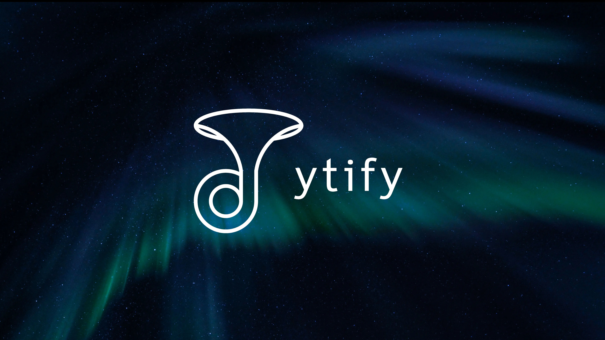

 

 

#
**ytify** is a simple web app that streams only audio from YouTube. With ytify, you can enjoy listening to podcasts, audiobooks, other audio focused youtube videos and ofcourse music without worrying about slow internet or data usage. It also comes with features like :

- **Queue** : Add multiple streams to keep your audio streams going. 🎵
- **Playlists Support** : Enqueue YouTube playlist to the native queue. 🎧
- **Theming** : Modern Autonomous themed UI based on stream thumbnail . 🎨
- **PWA** : Install ytify as an app on your device and open YouTube links with it from your OS share menu. 📱
- **Autoplay** : Plays related streams, great for music listeners on ytify.

## WHY / The story of ytify
- I was an avid [NewPipe](https://github.com/TeamNewPipe/NewPipe) user back in 2021, which I used for background playback.
- I noticed it wasn't able to stream under low network conditions which would occur when my daily data quota would expire.
- Newpipe allowed downloading audio of the stream in multiple bitrates (50kbps, 90kbps, 130kbps) but it only provided the best one when streaming. So i decided to create an [issue](https://github.com/TeamNewPipe/NewPipe/issues/5838).
- At the time I used to download opus audio, av1 video streams from https://projectlounge.pw/ytdl. The streams could easily be downloadable in required format by just modifying the site link , without any CORS issues.
- Things clicked in my mind, and I created this project, this was [the first build](https://github.com/n-ce/ytify/blob/bf129e573c56e99f88b51f679077cb9f8a9a6b3c/index.html) on Jan 2022.
- Months later the 5th Major version was released with its own backend which was then replaced by the piped API which is itself based off the newpipe extractor, so we came #fullCircle.

## [Licence 📝](https://github.com/n-ce/ytify/blob/main/LICENSE)
## [Contributing 📋](https://github.com/n-ce/ytify/blob/main/CONTRIBUTING.md)

## Acknowledgements 🙏
- [Piped](https://github.com/teampiped/piped)
- [Netlify](https://www.netlify.com)
- [Remix Icons](https://github.com/Remix-Design/RemixIcon)
- [Google Fonts](https://fonts.google.com)

