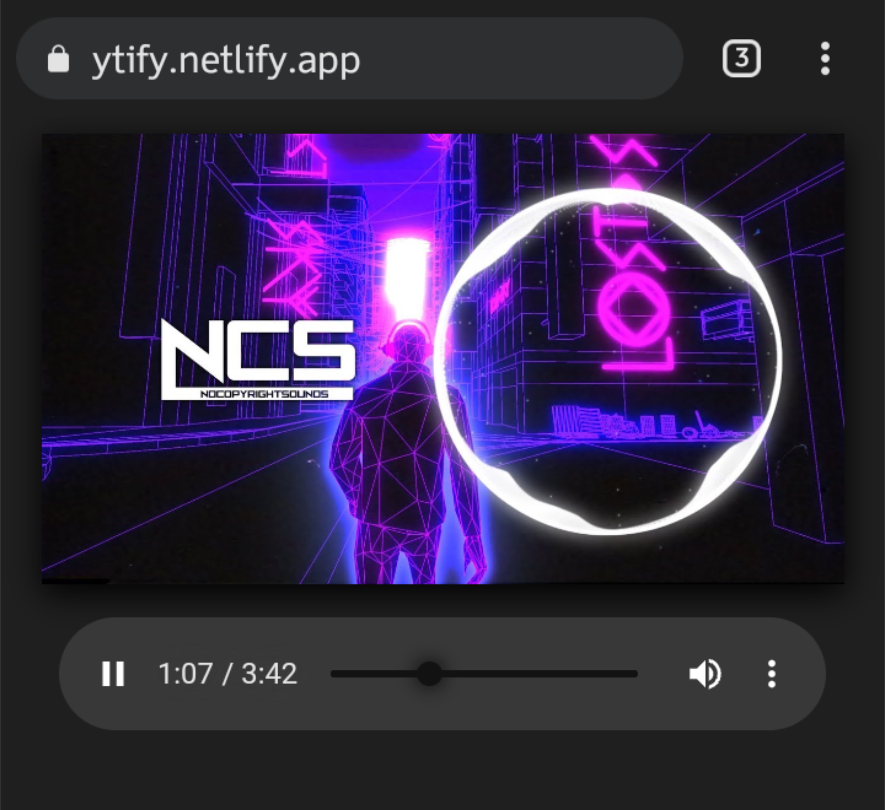

# ytify
Minimal youtube audio streaming front-end.

Streams youtube audio only in ultra low bitrate at around 50kbps, save data!

Production : https://ytify.netlify.app

## How it's used
- Copy youtube video link to clipboard.
- The link is automatically captured on the page and starts playing automatically.
