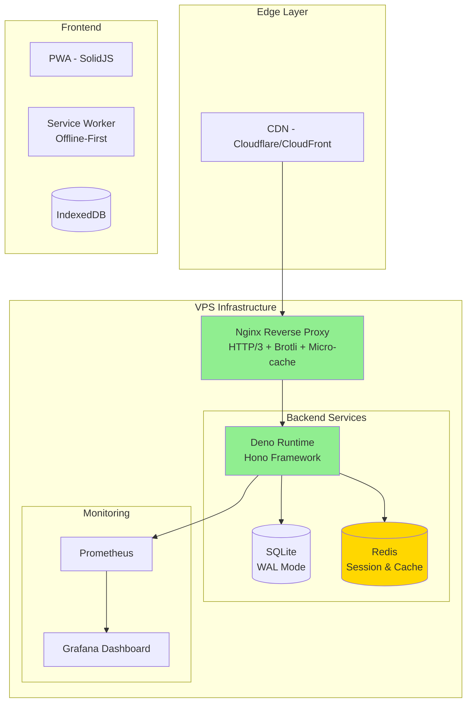

# YTFY Performance Optimization Plan

## Architecture Overview



## Current State Analysis

### Tech Stack

- **Frontend**: SolidJS 1.9.10 + Vite 7.3.1 + TypeScript
- **Backend**: Deno 2.1.0 + Hono 4.6.0 + SQLite (@db/sqlite)
- **Infrastructure**: Nginx + Docker + VPS
- **CI/CD**: GitHub Actions

### Identified Bottlenecks

1. **Nginx**: Basic gzip only, no HTTP/3, no Brotli, no micro-caching
2. **Backend**: In-memory LRU cache only, no Redis layer
3. **Frontend**: No code splitting, no bundle analysis
4. **Database**: Single connection, no pooling
5. **CI/CD**: No dependency caching, sequential builds
6. **Monitoring**: No observability stack

## Phase 1: Infrastructure Optimization

### Nginx Ultra-Performance Configuration

Features to implement:

- HTTP/3 with QUIC
- Brotli compression (20-25% smaller than gzip)
- Micro-caching (1-5s for dynamic content)
- Rate limiting zones
- TLS 1.3 + OCSP stapling
- Connection keepalive (64 connections)

### VPS Tuning

```bash
# /etc/sysctl.conf optimizations
net.core.somaxconn = 65535
net.ipv4.tcp_max_syn_backlog = 65535
net.ipv4.tcp_tw_reuse = 1
net.ipv4.ip_local_port_range = 1024 65535
net.core.netdev_max_backlog = 262144
net.ipv4.tcp_fin_timeout = 15
net.ipv4.tcp_keepalive_time = 300

# File descriptor limits
# /etc/security/limits.conf
* soft nofile 65535
* hard nofile 65535
```

## Phase 2: Caching Strategy

### Multi-Level Caching Architecture

| Level | Technology        | Use Case              | TTL     |
| ----- | ----------------- | --------------------- | ------- |
| L1    | Browser Cache     | Static assets         | 1 year  |
| L2    | Service Worker    | Offline-first         | Dynamic |
| L3    | Nginx Micro-cache | API responses         | 1-5s    |
| L4    | Redis             | Session/Heavy queries | 5-60min |
| L5    | SQLite            | Persistent storage    | N/A     |

### Stale-While-Revalidate Pattern

```http
Cache-Control: public, max-age=5, stale-while-revalidate=60
```

This allows serving stale content while refreshing in background.

## Phase 3: Frontend Optimization

### Code Splitting Strategy

```typescript
// Dynamic imports for routes
const Player = lazy(() => import("./features/Player"));
const Settings = lazy(() => import("./features/Settings"));
const Library = lazy(() => import("./features/Home/Library"));
```

### Bundle Optimization Targets

| Metric                 | Current | Target |
| ---------------------- | ------- | ------ |
| Initial JS             | ~150KB  | <100KB |
| Initial CSS            | ~30KB   | <20KB  |
| Time to Interactive    | ~3s     | <2s    |
| First Contentful Paint | ~1.5s   | <1s    |

### Resource Hints

```html
<!-- Preconnect to critical origins -->
<link rel="preconnect" href="https://music.ml4-lab.com" />
<link rel="preconnect" href="https://*.googlevideo.com" />
<link rel="dns-prefetch" href="https://accounts.google.com" />

<!-- Preload critical assets -->
<link rel="preload" href="/assets/index.js" as="script" />
<link rel="preload" href="/assets/index.css" as="style" />
<link rel="preload" href="/logo192.png" as="image" />
```

## Phase 4: Backend Optimization

### Database Connection Pooling

SQLite doesn't natively support connection pooling, but we can:

- Use WAL mode (already enabled) for concurrent reads
- Implement connection queue for writes
- Add prepared statement caching

### Redis Integration

```typescript
// Cache strategies
const CACHE_STRATEGIES = {
  library: { ttl: 300, key: "lib:" }, // 5 minutes
  streamData: { ttl: 600, key: "sd:" }, // 10 minutes
  searchResults: { ttl: 60, key: "sr:" }, // 1 minute
  suggestions: { ttl: 300, key: "sg:" }, // 5 minutes
};
```

### API Response Optimization

- Add ETag support for conditional requests
- Implement partial response (fields selection)
- Add compression for JSON responses

## Phase 5: Media Streaming Optimization

### Audio Preloading Strategy

```typescript
// Predictive preloading based on queue
elements.audio.preload = "metadata"; // For current track
elements.audioNext.preload = "none"; // For next track, load on 10s before end
```

### Adaptive Streaming

- Detect network quality (using Network Information API)
- Switch between 32kbps/64kbps/128kbps quality
- Buffer management based on connection type

## Phase 6: CI/CD Pipeline

### Optimized GitHub Actions

```yaml
# Key optimizations:
# 1. Dependency caching with exact lockfile hash
# 2. Parallel job execution
# 3. Artifact compression
# 4. Conditional deployment
```

### Deployment Strategy

1. Build and test in parallel
2. Deploy backend with zero-downtime (blue-green)
3. Deploy frontend with cache-busting
4. Run smoke tests
5. Rollback capability

## Phase 7: Monitoring Stack

### Lightweight Monitoring (No Kubernetes)

```yaml
# docker-compose.monitoring.yml
services:
  prometheus:
    image: prom/prometheus:latest
    volumes:
      - ./prometheus.yml:/etc/prometheus/prometheus.yml

  grafana:
    image: grafana/grafana:latest
    environment:
      - GF_SECURITY_ADMIN_PASSWORD=admin

  node-exporter:
    image: prom/node-exporter:latest
    # System metrics
```

### Key Metrics to Track

| Category       | Metrics                                  |
| -------------- | ---------------------------------------- |
| Frontend       | FCP, LCP, TTI, CLS, FPS                  |
| Backend        | Request rate, latency, error rate        |
| Infrastructure | CPU, memory, disk I/O, network           |
| Business       | Streams started, errors, cache hit rates |

## Performance Budgets

| Metric      | Budget  | Warning | Critical |
| ----------- | ------- | ------- | -------- |
| FCP         | < 1s    | 1.2s    | 1.5s     |
| LCP         | < 1.5s  | 2s      | 2.5s     |
| TTI         | < 2s    | 2.5s    | 3s       |
| TBT         | < 200ms | 350ms   | 500ms    |
| CLS         | < 0.1   | 0.15    | 0.25     |
| Bundle Size | < 150KB | 180KB   | 200KB    |

## Deployment Checklist

### Pre-deployment

- [ ] Run Lighthouse CI in PR
- [ ] Verify bundle size budget
- [ ] Check for security vulnerabilities
- [ ] Run integration tests

### Deployment

- [ ] Backup database
- [ ] Deploy Nginx config (test first)
- [ ] Deploy backend (zero-downtime)
- [ ] Deploy frontend with cache busting
- [ ] Verify health checks

### Post-deployment

- [ ] Monitor error rates
- [ ] Check performance metrics
- [ ] Verify cache hit rates
- [ ] Monitor server resources

## Expected Results

| Metric         | Before | After  | Improvement    |
| -------------- | ------ | ------ | -------------- |
| FCP            | ~1.5s  | <1s    | 33% faster     |
| TTI            | ~3s    | <2s    | 33% faster     |
| Lighthouse     | ~75    | 95-100 | 20-25 points   |
| API Response   | ~150ms | <50ms  | 66% faster     |
| Cache Hit Rate | 0%     | >80%   | New capability |
| Availability   | 99%    | 99.9%  | 10x better     |

## Next Steps

1. Switch to Code mode to implement configurations
2. Create all optimization scripts and files
3. Test configurations locally
4. Deploy incrementally with monitoring
5. Document lessons learned
